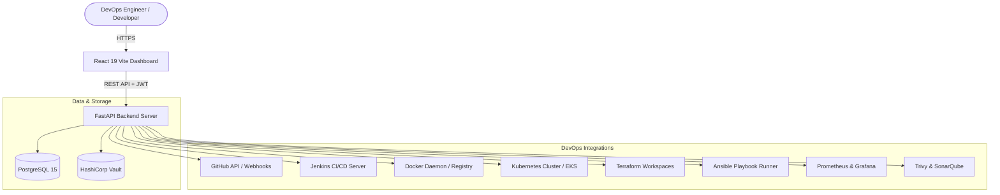

# DevOps Control Center

> **One Unified Dashboard to Build, Deploy, Monitor, and Manage Everything.**

[](https://github.com/acme-corp/devops-control-center/actions)
[](https://fastapi.tiangolo.com)
[](https://react.dev)
[](https://www.typescriptlang.org)
[](https://kubernetes.io)
[](https://www.terraform.io)
[](https://www.ansible.com)

---

## Table of Contents
- [Overview](#overview)
- [Architecture](#architecture)
- [Key Features](#key-features)
- [Tech Stack](#tech-stack)
- [Quickstart (Docker Compose)](#quickstart-docker-compose)
- [Default Credentials](#default-credentials)
- [Project Directory Structure](#project-directory-structure)
- [API Endpoints Reference](#api-endpoints-reference)
- [Infrastructure & Kubernetes Deployment](#infrastructure--kubernetes-deployment)
- [Automated Testing](#automated-testing)
- [CI/CD Pipeline](#cicd-pipeline)

---

## Overview
**DevOps Control Center** unifies essential DevOps tooling into a single, cohesive pane of glass. It connects source control, continuous integration, container registries, Kubernetes clusters, infrastructure-as-code, configuration management, security scanners, and real-time observability.

---

## Architecture



---

## Key Features

1. **Unified Dashboard**: Live metrics for active projects, container health, cluster nodes, deployment statuses, and security grades.
2. **Project & Pipeline Management**: Connect GitHub repositories and trigger automated Jenkins build pipelines with live log streaming.
3. **Container & Cluster Management**: Inspect running Docker containers, images, volumes, Kubernetes namespaces, deployments, and pods with restart/scaling capabilities.
4. **Infrastructure as Code**: Manage Terraform workspaces, trigger plans, and execute applies directly.
5. **Configuration Management**: Execute Ansible playbooks against dynamic host inventories.
6. **Security & Compliance**: Integrated static code analysis (SonarQube) and container vulnerability scanning (Trivy).
7. **Role-Based Access Control (RBAC)**: Fine-grained permissions for Admin, DevOps Engineer, and Developer roles.

---

## Tech Stack

| Layer | Technologies |
| :--- | :--- |
| **Frontend** | React 19, TypeScript, Vite, TailwindCSS, TanStack React Query, Lucide Icons, Chart.js |
| **Backend** | Python 3.11, FastAPI, SQLAlchemy ORM, Pydantic v2, Alembic, Pytest, Bcrypt, PyJWT |
| **Database** | PostgreSQL 15 with connection pooling and automated migration scripts |
| **Container & Orchestration** | Docker, Docker Compose, Kubernetes manifests, Kustomize |
| **Infrastructure as Code** | Terraform (AWS VPC & EKS modules) |
| **Automation** | Ansible playbooks (Docker setup, rolling deployments, OS patching) |
| **Observability** | Prometheus (metrics scraper & alerting), Grafana (provisioned dashboards) |
| **Security** | Trivy (container scan), SonarQube (SAST), bcrypt password hashing |

---

## Quickstart (Docker Compose)

### 1. Clone & Configure Environment
```bash
cp .env.example .env
```

### 2. Launch Stack
```bash
docker-compose up --build
```

The application will be accessible at:
- **Frontend Dashboard**: [http://localhost:3000](http://localhost:3000)
- **Backend API & Swagger Docs**: [http://localhost:8000/docs](http://localhost:8000/docs)
- **PostgreSQL Database**: `localhost:5432`

---

## Default Credentials

The database is pre-seeded with the following accounts:

| Role | Email | Password | Permissions |
| :--- | :--- | :--- | :--- |
| **Admin** | `admin@devops.io` | `adminpassword123` | Full access to users, projects, infra, and settings |
| **DevOps** | `devops@devops.io` | `adminpassword123` | Manage projects, infra, deployments, and logs |
| **Developer** | `developer@devops.io` | `adminpassword123` | View projects, trigger pipelines, and view logs |

---

## Project Directory Structure

```
devops-control-center/
├── .github/
│   └── workflows/          # GitHub Actions CI/CD pipeline (ci-cd.yml)
├── ansible/                # Ansible playbooks (Docker, Deploy, OS updates) & inventory
├── backend/                # FastAPI application
│   ├── alembic/            # Database migration scripts (0001_initial_schema.py)
│   ├── app/
│   │   ├── api/v1/         # API endpoints (auth, projects, docker, k8s, etc.)
│   │   ├── core/           # Security, database session, config, init_db
│   │   ├── models/         # SQLAlchemy ORM models
│   │   └── schemas/        # Pydantic schemas
│   ├── tests/              # Automated test suites (pytest / standalone runner)
│   └── requirements.txt
├── database/               # Standalone DDL (schema.sql) and seed data (seed.sql)
├── docker/                 # Docker Compose & container service configurations
├── docs/                   # Architectural specifications & documentation (17 docs)
├── frontend/               # React 19 + Vite + Tailwind frontend application
│   └── src/
│       ├── components/     # Layout, Navbar, Sidebar, ProtectedRoute
│       ├── pages/          # 15 distinct views & integration pages
│       └── services/       # Axios API clients
├── kubernetes/             # Kubernetes manifests (Deployments, StatefulSets, Ingress)
├── monitoring/             # Prometheus scrape configs, alert rules, Grafana dashboards
├── scripts/                # Automated setup and test runner scripts
├── security/               # Trivy and SonarQube configuration files
├── terraform/              # Terraform AWS VPC and EKS cluster modules
├── docker-compose.yml      # Root multi-container orchestration
└── README.md
```

---

## API Endpoints Reference

| Prefix | Method | Endpoint | Description |
| :--- | :--- | :--- | :--- |
| `/api/v1/auth` | `POST` | `/login` | Authenticate and obtain JWT access & refresh tokens |
| `/api/v1/auth` | `POST` | `/register` | Register a new user |
| `/api/v1/auth` | `GET` | `/me` | Retrieve profile of authenticated user |
| `/api/v1/projects` | `GET/POST` | `/` | List all projects / Create new project |
| `/api/v1/deployments`| `GET/POST` | `/` | List all deployments / Trigger deployment |
| `/api/v1/deployments`| `GET/POST` | `/pipelines` | List pipelines / Register new pipeline |
| `/api/v1/github` | `GET` | `/repositories` | List connected GitHub repositories |
| `/api/v1/jenkins` | `GET/POST` | `/jobs` & `/build/{name}` | View Jenkins jobs / Trigger build |
| `/api/v1/docker` | `GET` | `/containers` & `/images` | List Docker containers & images |
| `/api/v1/kubernetes` | `GET` | `/deployments` & `/pods` | List K8s deployments, pods, namespaces |
| `/api/v1/terraform` | `GET/POST` | `/workspaces` & `/plan` | List workspaces / Trigger plan |
| `/api/v1/ansible` | `GET/POST` | `/inventories` & `/execute`| List inventory / Run playbooks |
| `/api/v1/monitoring`| `GET` | `/metrics` & `/alerts` | Prometheus live metrics & active alerts |
| `/api/v1/security` | `GET` | `/sast` & `/images` | SonarQube metrics & Trivy image scans |

---

## Automated Testing

Run all backend tests and frontend typechecks in a single command:

### On Linux / macOS:
```bash
./scripts/run_tests.sh
```

### On Windows (PowerShell):
```powershell
powershell -ExecutionPolicy Bypass -File scripts\run_tests.ps1
```

---

## Infrastructure & Kubernetes Deployment

Deploy the entire stack to a Kubernetes cluster using Kustomize:

```bash
kubectl apply -k kubernetes/
```

To provision the underlying AWS infrastructure (VPC and EKS cluster):

```bash
cd terraform
cp terraform.tfvars.example terraform.tfvars
terraform init
terraform plan
terraform apply
```
