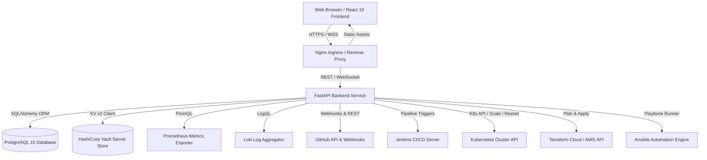
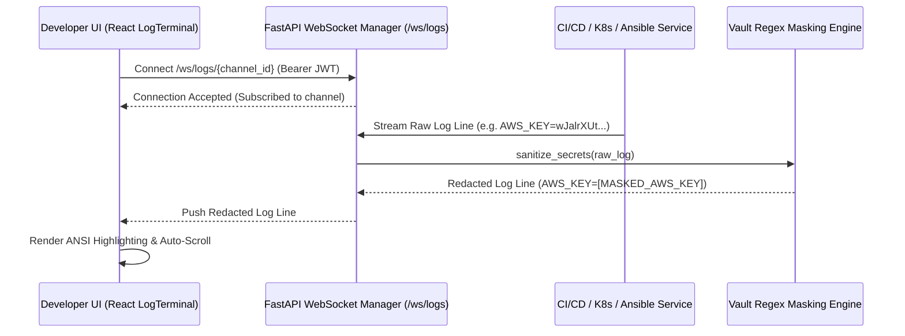
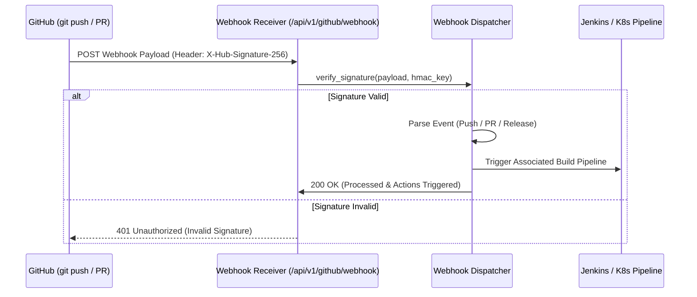
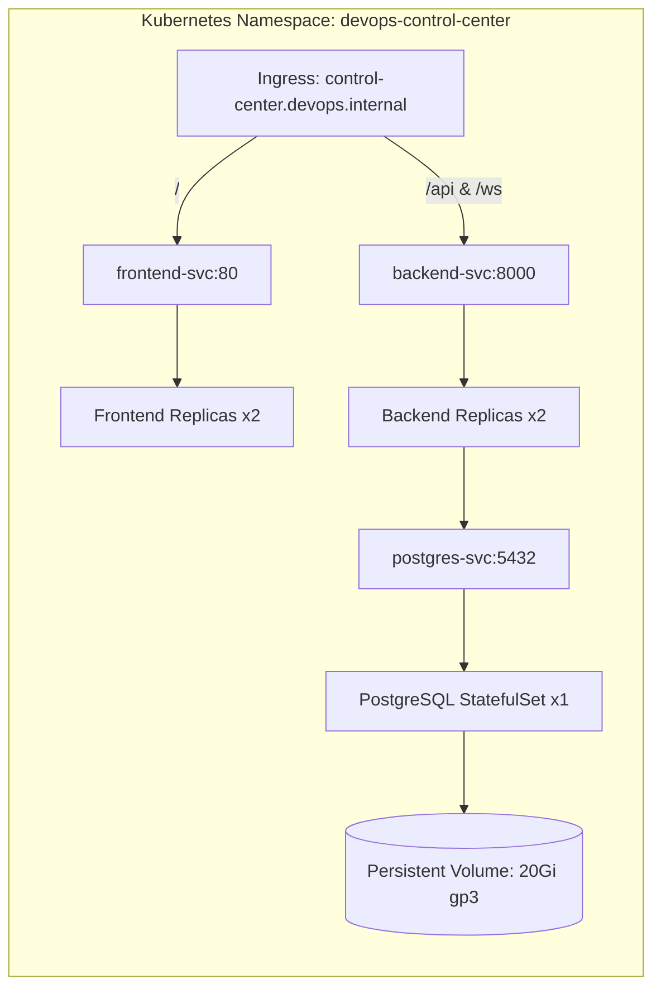

# DevOps Control Center - System Architecture

Comprehensive architectural overview and topology diagrams for the **DevOps Control Center** platform.

---

## 1. High-Level Architecture Diagram

---

## 2. Real-Time WebSocket & Log Redaction Pipeline

---

## 3. GitHub Webhook CI/CD Trigger Flow

---

## 4. Kubernetes Production Deployment Topology

