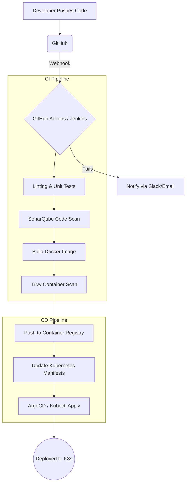

# CI/CD Pipeline Architecture

## Description
1. **Continuous Integration**: On every PR or push to main, automated tests and security scans run. If SonarQube or Trivy detect critical issues, the build fails.
2. **Continuous Deployment**: Once the Docker image is built, scanned, and pushed to the registry, the deployment process triggers. For staging, this is automatic. For production, it may require manual approval.
