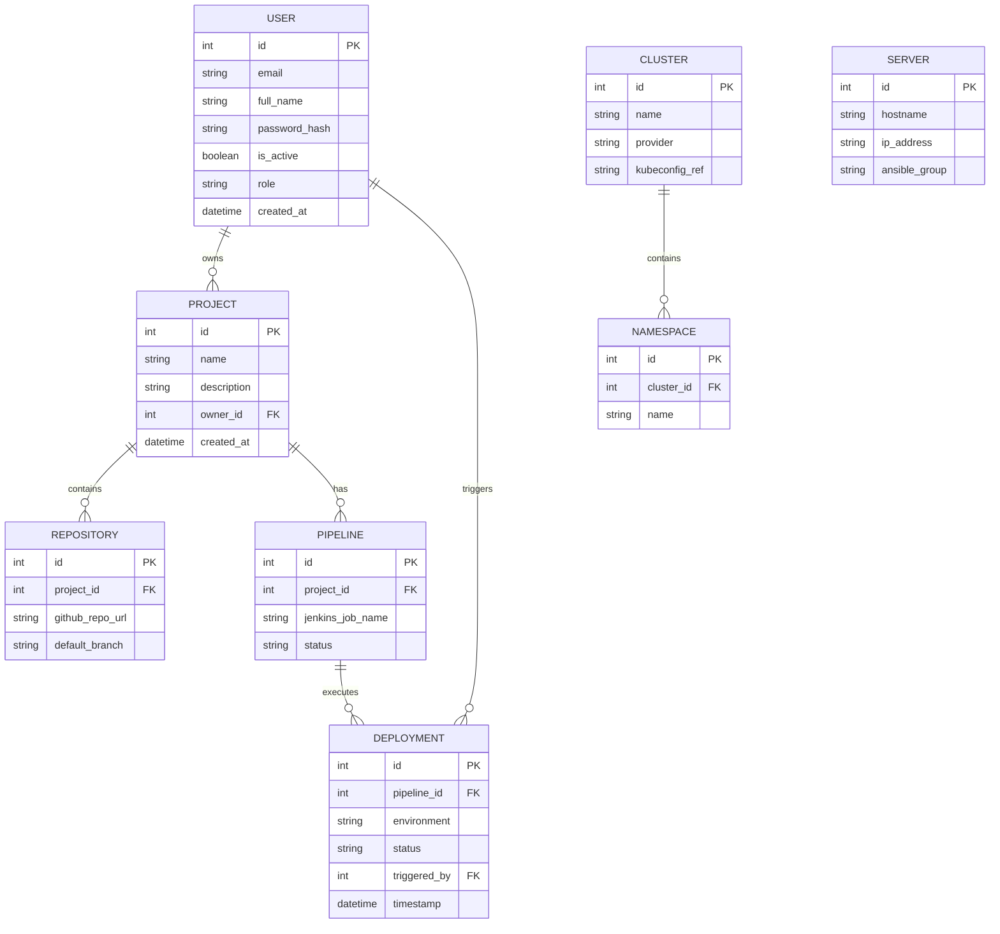

# Entity-Relationship (ER) Diagram

```mermaid
erDiagram
    USER {
        int id PK
        string email
        string full_name
        string password_hash
        boolean is_active
        string role
        datetime created_at
    }

    PROJECT {
        int id PK
        string name
        string description
        int owner_id FK
        datetime created_at
    }

    REPOSITORY {
        int id PK
        int project_id FK
        string github_repo_url
        string default_branch
    }

    PIPELINE {
        int id PK
        int project_id FK
        string jenkins_job_name
        string status
    }

    DEPLOYMENT {
        int id PK
        int pipeline_id FK
        string environment
        string status
        int triggered_by FK
        datetime timestamp
    }

    CLUSTER {
        int id PK
        string name
        string provider
        string kubeconfig_ref
    }

    NAMESPACE {
        int id PK
        int cluster_id FK
        string name
    }

    SERVER {
        int id PK
        string hostname
        string ip_address
        string ansible_group
    }

    USER ||--o{ PROJECT : owns
    USER ||--o{ DEPLOYMENT : triggers
    PROJECT ||--o{ REPOSITORY : contains
    PROJECT ||--o{ PIPELINE : has
    PIPELINE ||--o{ DEPLOYMENT : executes
    CLUSTER ||--o{ NAMESPACE : contains
```
