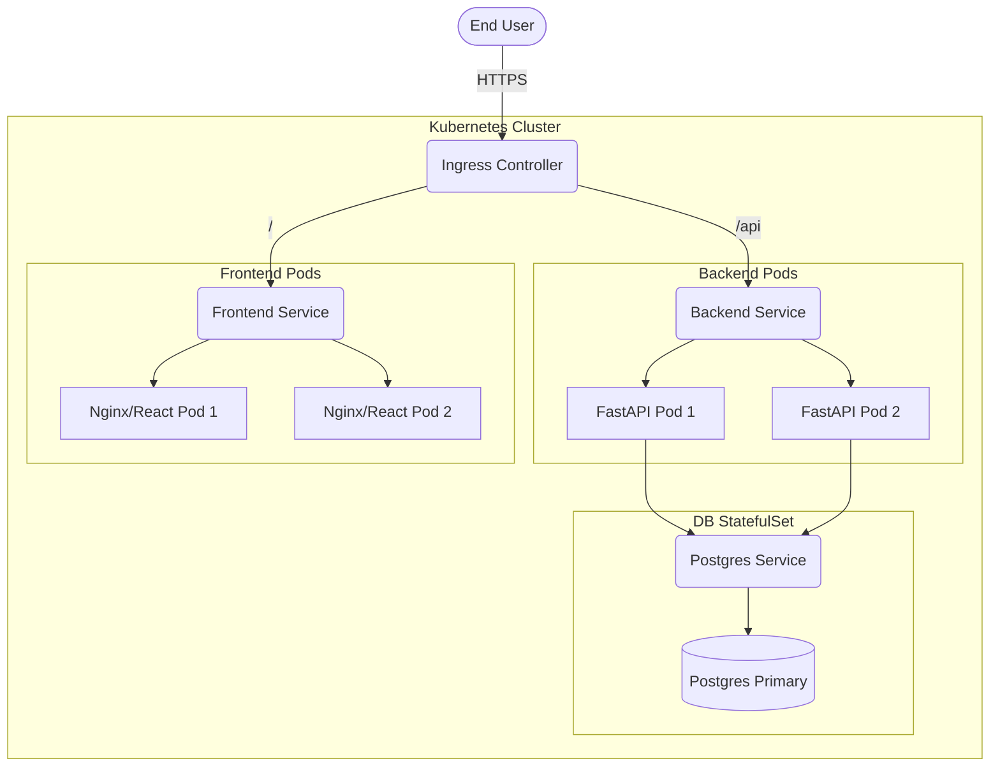

# Kubernetes Architecture

## Description
- **Ingress**: Manages external access, TLS termination, and path-based routing.
- **Frontend & Backend**: Deployed as stateless `Deployments` with multiple replicas for High Availability.
- **Database**: Handled as a `StatefulSet` with Persistent Volume Claims (PVC) if hosted inside the cluster, or as an ExternalName service if using a managed cloud DB.
