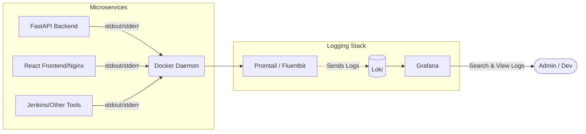

# Logging Architecture

## Description
- **Log Generation**: All applications (FastAPI, Nginx, Jenkins, etc.) are configured to output logs to standard output/error in JSON format (where possible).
- **Log Collection**: A log shipper like Promtail (or Fluentbit) runs as a DaemonSet on the Kubernetes nodes, reading the container logs.
- **Log Aggregation**: Logs are shipped to Grafana Loki, which indexes them efficiently based on labels rather than full-text indexing.
- **Log Visualization**: Users can use Grafana to view, query, and set up alerts based on logs using LogQL.
