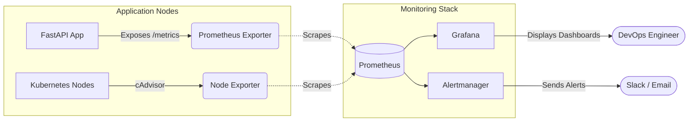

# Monitoring Architecture

## Description
- **Prometheus**: Acts as the central time-series database. It scrapes metrics from the FastAPI application (which uses a Prometheus middleware) and the Kubernetes nodes.
- **Grafana**: Queries Prometheus to visualize data in custom dashboards (CPU, Memory, Request Latency).
- **Alertmanager**: Configured to route critical alerts from Prometheus to communication channels like Slack or Email.
